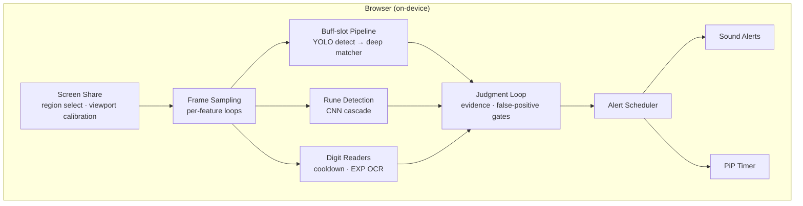
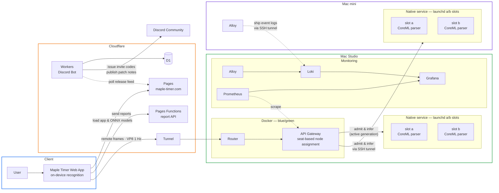

# Maple Timer — 메이플스토리 실시간 알림 도우미

> **https://maple-timer.com**

## 프로젝트 개요

Maple Timer는 메이플스토리 플레이 화면을 **브라우저 안에서 실시간 분석**해
스킬 재설치·룬 출현·버프 종료 같은 순간을 놓치지 않게 알려주는 웹 서비스입니다.

- 사용자가 직접 선택한 **화면 공유 영역만** 분석합니다. 게임 클라이언트,
  메모리, 패킷, 키보드/마우스 입력에는 일절 접근하지 않습니다.
- 모든 감지 모델(YOLO 버프 감지, CNN 룬 감지, 숫자 OCR)은 직접 수집·학습한
  자체 모델이며, 기본 동작은 **온디바이스**(WebGPU/WASM)로 실행됩니다.
- 무거운 parser 연산은 **원격 인식**으로 전용 추론 서버에 오프로드할 수
  있어, 저사양·CPU 모드 환경에서도 정밀 감지를 사용할 수 있습니다.
- 설치가 필요 없는 웹앱으로, 브라우저 탭 하나로 동작합니다.

## 시연


> 원본 영상: [demo.mp4](https://github.com/maple-timer/.github/raw/main/profile/demo.mp4)

## 성과

**2026-07-26 14:19 (KST)** — 실시간 동시 접속 **1,000명**(최근 30분 기준), 알림 재생 이벤트 30분당 1.7만 회.


## 구조

### 메인 앱 — 모든 인식이 브라우저 안에서

핵심은 앱 자체입니다. 화면 공유 한 번으로 아래 파이프라인 전체가
사용자 기기 안에서 돌아갑니다.



- 인식 모델은 Web Worker + onnxruntime-web(WebGPU, WASM 폴백)으로 실행됩니다.
- 판정 루프가 프레임 증거를 모아 오탐 게이트를 통과한 것만 알림으로 이어집니다.

### 서비스 아키텍처



- 원격 인식은 무거운 parser 연산만 전용 서버로 오프로드하는 선택
  기능입니다(초대 코드 기반). 게이트웨이는 각 노드의 실시간 좌석
  현황을 보고 배정하며, 노드마다 a/b 두 세대를 함께 띄워 **무중단
  롤링 업데이트**로 교체합니다.
- 두 노드의 이벤트 로그는 Alloy가 라벨을 정제해 Loki로 모으고,
  Grafana 대시보드에서 함께 조회합니다.

## 기술 스택

| 영역 | 기술 |
| --- | --- |
| Frontend | React, TypeScript, Vite, onnxruntime-web (WebGPU/WASM), Web Workers |
| Edge | Cloudflare Pages · Functions · Workers · D1 |
| Gateway | Node.js, Docker blue/green, 좌석 기반 동적 노드 배정 |
| Native | Python, ONNX Runtime (CoreML), numba 전처리, launchd a/b 슬롯 |
| ML | YOLOv8n 버프 감지, CenterNet/Cascade 룬 감지, 자체 OCR — 전 모델 자체 학습 |
| Observability | Grafana, Loki, Prometheus, Alloy |

## 저장소 구조

```
src/
  app/            화면 조립 · 모달 · 모니터링 워크스페이스
  features/       기능별 UI (알림 패널, 캡처, 설정, 리포트)
  runtime/        프레임 루프 · 분석 파이프라인 · 증거 수집
  recognition/    인식 알고리즘 (버프칸, 룬, 쿨다운/경험치 OCR)
  platform/       브라우저 어댑터 (캡처, 워커, 저장소)
  application/    세션 · 원격 인식 컨트롤러
  contracts/      기능 간 계약 타입
  domain/ lib/    타이머 · 오디오 · 도메인 로직
public/models/    브라우저에서 실행되는 ONNX 모델
functions/api/    Cloudflare Pages Functions (제보 수집 API)
scripts/          모델 감사 · 빌드 · 데이터 도구
```

## 로컬 실행

```bash
npm install
npm run dev      # http://localhost:5173
npm test         # vitest
npm run build    # 프로덕션 빌드
```

화면 공유 API를 사용하므로 브라우저에서 화면 공유 권한이 필요하며,
크로미움 계열 최신 브라우저를 기준으로 개발합니다.

## 이 저장소에 대해

실제 서비스 코드를 공개용으로 정리한 미러입니다. 운영 문서, 배포 스크립트,
내부 인프라 설정은 포함하지 않습니다. 이슈·PR보다는
[maple-timer.com](https://maple-timer.com)의 문의/피드백 창구를 이용해주세요.

## 라이선스 · 권리

- 이 저장소의 소스 코드는 **열람 목적으로만 공개**됩니다. 복제, 배포, 수정,
  상업적 이용은 허용되지 않습니다. 자세한 내용은 [LICENSE](LICENSE)를 참고하세요.
- 메이플스토리 및 게임에서 유래한 이미지·아이콘·명칭의 권리는 넥슨에 있으며,
  이 저장소의 라이선스가 적용되지 않습니다.
- Maple Timer는 넥슨 또는 메이플스토리의 공식 서비스가 아닙니다.
